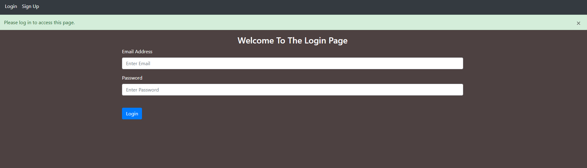
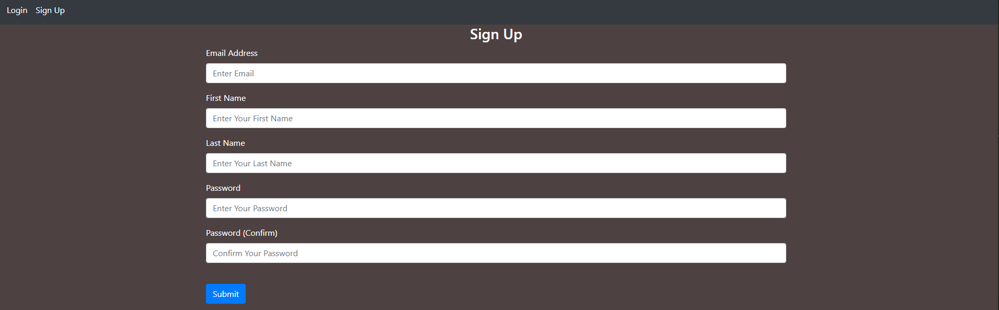
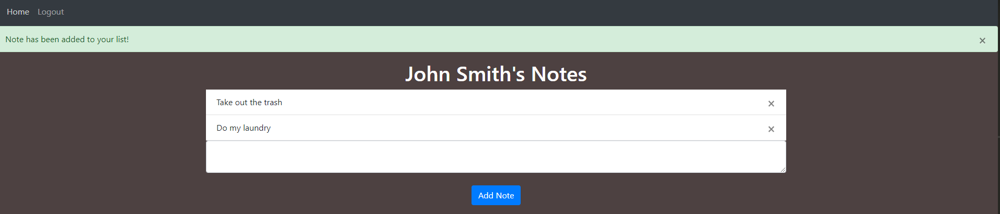

# Python ToDo Website

A simple todo list website, where users can make notes while logged into their respective accounts. Using Python, Flask, and elements of HTML/CSS, this website integrates authentication for user accounts. When accounts are made, their information is securely saved within a database. Users have the ability to create new notes, or delete existing ones as you would for notes or a todo list.

# References
Tech With Tim (https://www.youtube.com/c/TechWithTim)
